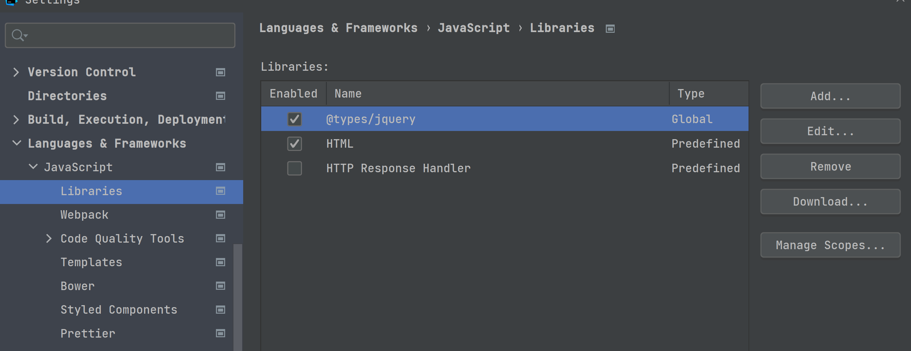

[TOC]


# *jQuery의 역사?*

- *JavaScript*는 Web Page를 동적으로 handling하기 위한 Web 언어
  - 언어 자체가 약간 어려운 편
  - 함수형 언어와 객체지향언어의 특성을 둘 다 가지고 있음
- 실행 환경 : browser환경
  - 따라서 JavaScript Engine은 browser안에 포함되어 있다
  - browser는 여러 종류가 있으므로 Engine도 여러가지 종류가 있다
  - 결국은 **Fragmentation(파편화)현상**이 발생하게 됨
    - (중구난방, 브라우저 호환성▼)
  - '표준' 이란 것의 의미가 떨어지게...
- 따라서 이를 위해 TypeScript라는 언어를 새로 표준으로 지정, 발전중!
  - JavaScript의 언어적인 면만 떼와서 표준으로 지정한 것
- 이러한 문제 때문에 순수한 JavaScript언어를 사용하는 것보다 다른 방법을 이용해서 browser의 동적처리를 할려고 시도
  - 여러가지 library를 만들어 사용
  - library들은 흥망성쇠를 거듭하다가 하나가 남은 것이 ***==jQuery==***
    - 그 외는 거의 다 망해버린다


# *jQuery*

- 가장 큰 특징은 ***cross platform(browser)***을 지원
- 쉽고 빠르게 배울 수 있다
  - 전세계인들에게 접근성▲
- **화면제어를 쉽게 할 수 있다**
- **AJAX구현을 쉽게 할 수 있다**
  - 비동기 자바스크립트 통신
  - 자바스크립트를 이용한 데이터 통신 방법
- **Open Source(무료로 사용할 수 있다)**
  - 조금 다른 관점!
    - 회사에서 프로그래밍할 때는 **보안성**, 견고성, 표율성(퍼포먼스), 호환성을 고려해야함
    - 무조건 오픈소스를 가져다가 쓸 경우 리스크를 안게 된다
    - 따라서 회사에서는 보통 잘 만든 프로그램/소스를 돈을 주고 산다..
  - 아무튼 전세계에서 쓰는, 검증된 오픈소스.


## *그러면 jQuery를 사용하려면?*

- Download / **CDN방식** 등
- Bootstrap과 마찬가지로 CDN 방식으로 사용할 것
  - https://code.jquery.com/
  - CDN의 정송량을 위해 minified 버전을 사용한다.



- WebStorm에 jQuery library 를 설치해두면 도움이 된다.


## *jQuery.html (original)*

```html
<!DOCTYPE html>
<html lang="en">
    <head>
      <meta charset="UTF-8">
      <title>Title</title>
        
      <!-- jQuery를 위한 CDN 코드 -->
      <!-- jQuery CDN(Content Delivery Network)-->
      <script src="https://code.jquery.com/jquery-2.2.4.min.js" integrity="sha256-BbhdlvQf/xTY9gja0Dq3HiwQF8LaCRTXxZKRutelT44=" crossorigin="anonymous"></script>
        
      <!-- Bootstrap CDN(Content Delivery Network)-->
      <link href="https://cdn.jsdelivr.net/npm/bootstrap@5.0.2/dist/css/bootstrap.min.css" rel="stylesheet" integrity="sha384-EVSTQN3/azprG1Anm3QDgpJLIm9Nao0Yz1ztcQTwFspd3yD65VohhpuuCOmLASjC" crossorigin="anonymous">
      <script src="https://cdn.jsdelivr.net/npm/bootstrap@5.0.2/dist/js/bootstrap.bundle.min.js" integrity="sha384-MrcW6ZMFYlzcLA8Nl+NtUVF0sA7MsXsP1UyJoMp4YLEuNSfAP+JcXn/tWtIaxVXM" crossorigin="anonymous"></script>

      <script src="js/0714_jQuery.js"></script>
    </head>
    <body>
      <h1>하이요 이건 h1</h1>
    <!-- <ul>: unordered list, 둥근 점으로 리스트 목록 표현-->
      <ul> <!-- parent -->
        <li class="city">서울</li><!-- child -->
        <li class="city2">busan</li><!-- 형제 sibling -->
      </ul>
      <div>여기는 div 영역</div>
      <div>
        <ol><!-- ordered list -->
          <li>홍길동</li> <!-- block level element -->
          <li id="cat">고양이</li>
          <li>강아지</li>
        </ol>
      </div>
      <button type="button"
              class="btn btn-primary"
              onclick="myFunc()"> click! </button>
    </body>
</html>
```


# *jQuery.js*

- - jQuery는 기본적으로
	1. 내가 제어하길 원하는 Element를 선택
	2. 선택된 Element에 대해 method를 호출, 원하는 대로 제어
		- jQuery는 ``$``로 시작

```javascript
$("selector라고 불리는 특수한 형태의 문자열")
$("h1")
```
- `<h1>` element를 찾아서 객체화시켜 JavaScript영역으로 가져옴 *(document object: 문서 객체)*
- 가져온 문서객체를 jQuery객체로 가져옴

```javascript
$("h1").remove()
```

- 이런 형태로 모든걸 해결!


# Selector

## 1. universal selector

- 전체 선택자, ``*``
  - 모든 element를 선택
- ``.css()``: 스타일 변경을 위한 메소드

```javascript
$("*").css('color', 'red')
```


## 2. Tag selector

- 태그 선택자, ``" "``, ``' ' ``
- 문자열 형태로 selector 명시, 해당 이름의 모든 태그 선택
  - 여러개의 선택: 한 문자열에서 ,로 구분

```javascript
$("li").css('background-color', 'yellow')
$("li, h1").css('color', 'black')
```


## 3. ID selector

- 아이디 선택자, ``#``
- 기호를 기억해둘 것!
- ``.text() ``: 
  1. id를 찾아서 그 element tag 사이에 있는 글자를 이것으로 바꾼다
  2. 인자를 주지 않을 경우 tag 안의 값을 return
```javascript
$("#cat").text("소리없는 아우성!")
$("#cat").text()
```


## 4. class selector

- 클래스 선택자, ``.``
- `.remove()` : html의 내용은 그대로고 화면만 변하게 된다
```javascript
$(".city").remove()
```


## 5. structure? selector 구조선택자

- 구조선택자


### 1. 자식선택자

- 자식선택자, `` >``
- 여러가지를 선택할 때 어떻게 선택할 지 우리가 잘 골라야 한다
- 따라서 선택자는 종종 여러개를 섞어 쓰게 되므로, 센스를 필요로 하게 된다
```javascript
// ol의 자식 중 전부
$('ul > *').text()
//이런식
$('ol > li').css('background-color', 'navy')
```


### 2. 후손선택자

- 후손선택자, ``  `` (공백)
- 후손은 내 자식을 포함하여 그 밑을 전부 선택
```javascript
$('div li')
```


### 3. 동위선택자

- 동위선택자, ``+ (바로 다음에 나오는 형제)`` 
- 형제 찾기. 나를 기준으로 내 바로 다음의 형제 선택
```javascript
$('#cat + li').text("리트리버") //이렇게 명확하게 표현하는 것이 좋다
```


### 4. 동위선택자

- 동위선택자, ``~`` 
- 다음에 나오는 형제들 싹 다
- ``*``을 이용해 명확하게 표현하는 것이 좋다
```javascript
$('#cat ~ *').text()
```


## 6. attribute selector
- 속성 선택자, ``[]``
- 속성 명을 적어주면 된다
```javascript
$('[type]').css('color', 'red')
$('[type=button]')  //혹은이렇게도 지정하여 찾을 수 있다
```


---

## *jQuery.js (original)*

```javascript
// original file
function myFunc() {
    //alert('클릭됐어요');
    //jQuery는 기본적으로
    //1. 내가 제어하길 원하는 Element를 선택
    //2. 선택된 Element에 대해 method를 호출, 원하는 대로 제어

    //jQuery는 $로 시작
    //$("selector라고 불리는 특수한 형태의 문자열")
    //$("h1")
    //<h1> element를 찾아서 객체화시켜 JavaScript영역으로 가져옴
    //document object: 문서 객체
    //가져온 문서객체를 jQuery 객체로 가져옴

    $("h1").remove()
    //이런 형태로 모든걸 해결!

    //$ : Unresolved variable or type $
    //warning이 뜬다고 무조건 안되는건 아님!
    //그런데 보기는 싫으니까... jQuery 제대로 쓴거 맞으니까...
    //tool에게 jQuery 존재를 인식시키기

    //selector부터!
    // 1. universal selector(전체선택자) => *
    $("*").css('color', 'red')
    //이렇게 하면 모든 element 선택
    //.css(): 스타일 변경을 위한 메소드

    //2. Tag selector(태그 선택자) => 문자열 형태로 selector 명시, 해당 이름의 모든 태그 선택
    $("li").css('background-color', 'yellow')
    //여러개의 선택: 한 문자열에서 ,로 구분
    $("li, h1").css('color', 'black')

    //3. ID selector(아이디 선택자) => # 이용
    //기호를 기억해둘 것!
    //.text - 1.id를 찾아서 그 element tag 사이에 있는 글자를 이것으로 바꾼다
    //        2.인자를 주지 않을 경우 tag 안의 값을 return
    $("#cat").text("소리없는 아우성!")
    $("#cat").text()

    //4. class selector => . 이용
    //html의 내용ㅇ은 그대로고 화면만 변하게 된다
    $(".city").remove()

    //5. structure? selector 구조선택자
    //  자식선택자 => > 꺽쇠
    // 여러가지를 선택할 때 어떻게 선택할 지 우리가 잘 골라야 한다
    // ol의 자식 중 전부
    $('ul > *').text()
    // 이런식
    $('ol > li').css('background-color', 'navy')
    // 따라서 선택자는 종종 여러개를 섞어 쓰게 되므로, 센스를 필요로 하게 된다

    //  후손선택자 => 후손은 내 자식을 포함하여 그 밑을 전부 선택
    //  후손선택자 => 공백으로
    $('div li')

    //  동위선택자 => 형제를 찾기
    //  동위선택자 => + 는 나를 기준으로 내 바로 다음의 형제 선택
    //  동위연산자 : + (바로 다음에 나오는 형제)
    // $('#cat + li').text("리트리버") //이렇게 명확하게 표현하는 것이 좋다
    //  동위선택자 : ~ (다음에 나오는 형제들 싹 다)
    $('#cat ~ *').text()
    //이렇게 명확하게 표현하는 것이 좋다

    //6. attribute selector 속성 선택자 => []
    //속성 명을 적어주면 된다
    $('[type]').css('color', 'red')
    //혹은
//    $('[type=button]') //이렇게도 지정하여 찾을 수 있다

}
```

